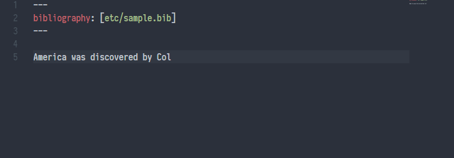

# Pandoc Citer Extension for Visual Studio Code

This extension provides autocompletion of citations stored in a bibtex file, for use with [pandoc-markdown](https://pandoc.org/) documents. 

## Features

### Autocomplete citations



- Citations follow the standard syntax recognized by [pandoc-citeproc](https://github.com/jgm/pandoc-citeproc), i.e.: 
    - Citation syntax: `@BibKey` or `[@bibKey]`
        + Typing '@' should automatically trigger the suggestion window to show up. If not, try `Ctrl + Space`.
        + The suggestion window (probably) won't trigger if the `@` is right after some text without a space, i.e. `text@` won't trigger the suggestions but `text @` will. This restriction was made so that typing an email address won't trigger the citation suggestions.
    - The YAML should contain the line 
    ```
    bibliography: [path/to/.bib]
    ```
    + The path/to/.bib should be enclosed by square brackets, and could be either a relative or absolute path
    + Multiple bib files can be included if separated by comma, e.g. `[path/to/refsA.bib, path/to/refsB.bib]`

### Configuration

- `PandocCiter.ViewType`
    + Type: String, either "inline" (default) or "browser"
    + Function: Changes how the suggested citations are shown
- `PandocCiter.RootFile`
    + Type: String, path to markdown file
    + Function: This is useful if there are multiple markdown files with one external master file containing the YAML header with the `bibliography: [path/to/bib]` entry. This avoids having to insert the bibliography YAML header into each individual file. 
- `PandocCiter.ShowLog`
    + Type: Boolean
    + Function: This will show a log in the Output panel, useful for answering questions like "Why isn't the extension finding my bib file?". The Output panel can be accessed via `VSCode Top Menubar -> View -> Output` which will open a panel at the bottom. Select `PandocCiter` from the drop down list, and the extension's log should show up.

## Acknowledgements

- This extension is essentially a stripped down version of the [LaTeX-Workshop extension](https://github.com/James-Yu/LaTeX-Workshop) that has been adjusted for markdown/pandoc.  
